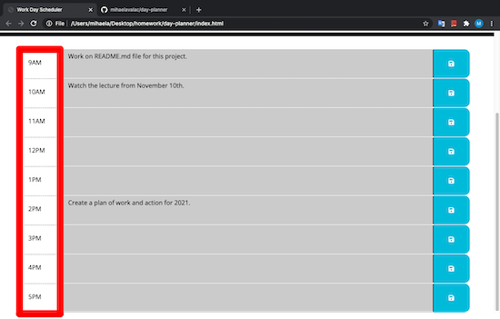
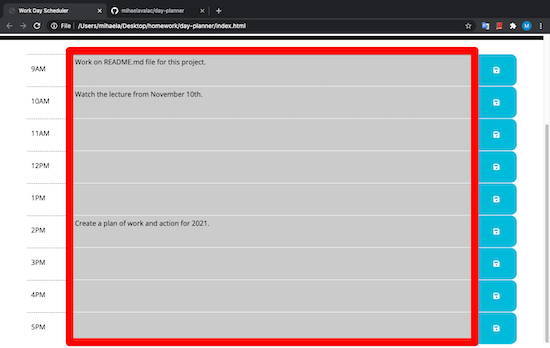
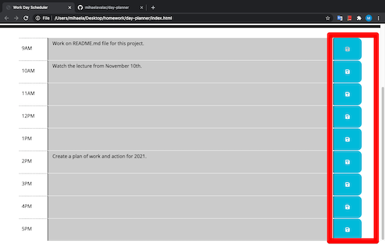

# Day-planner
# Description
For this project I designed a Work Day Schedule which is very helpful and easy to use for workers of all industries.

# Structure
The schedule show the current day in the dd/mm/date format above the schedule area. 

The schedule have three sections.
The first section includes the time which represents the work hours (in this case the schedule is from 9AM to 5PM).

The second section represents the area where the user writes the necessary to complete tasks at the specific time.

 

The last section represents the save buttons that react on click and store the information in the local storage.

Also, the time and tasks are differentiated by background color.
The red background color of the textarea represents the current time, the green background color of the textarea represents the upcoming time, and the gray background color of the textarea represents the past time.   

# # Deployment link
https://mihaelavalac.github.io/day-planner/